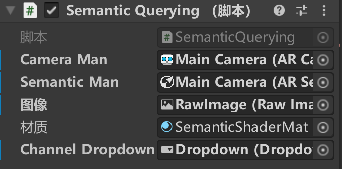

# EastenRed 东方红 :sparkling_heart:
🐒An AR game that even a monkey can easily pick up.🐵一款AR碰撞检测小游戏 
## 安装 installation
本游戏中有涉及LightShip中的语义遮蔽功能 所以需要提前在unity中配置好LightShip环境

LightShip官网：
https://lightship.dev/products/ardk/

## 项目概述 Project Overview
本项目的初衷是在天空中游玩，您可以将手机绑于无人机上体验一些新奇的飞行体验。程序内部带有Holokit双目渲染组件，您也可以选择将其带在头上沉浸式体验游戏的快乐。滑板、跑步、开车都可以打开游戏玩耍。

can:🚁 🏃‍♀️ 🛹 🚲 🛴 🚕 👨‍🦽

这个项目构想旨在为玩家提供一种新颖的飞行体验，即使在低配设备上也能流畅运行。游戏的核心是玩家控制一辆小型穿梭机，在太空中进行飞行任务。除了太空飞行外，玩家还可以在陆地上进行游戏，发现隐藏的乐趣和挑战。整个游戏将注重玩家的体验，力求为他们带来令人兴奋和愉悦的游戏体验。

游戏中，天空会变成红色。面前会出现法阵，手机触碰到法阵会加分。倒计时结束后会在前方地面生成桃花树🌺。随着现实时间的变化，画面呈现的效果也不一样。（如下图）

## 项目灵感🛰️ Project inspiration
项目名来源于中国🐉第一颗人造卫星东方红一号，一边播放着东方红一边升上太空。为了致敬东方红，当无人机飞起时会将播放东方红的手机投放到空中。指引箭头会跟着音乐节奏闪烁✨。
东方红红遍了半边天，所以当程序开启时天空会变成红色🟥。
东方红太阳升，开启的法阵为红色的太阳🌞，寓意着新时代的开始。

## How does it work它是如何工作的
### 脚本
🥰触发脚本（chufa） 内含箭头生成 法阵生成 分数计算 高度到达时开启游戏等大部分功能

（因为是自己敲的大框架所以都堆到一个里面了 下次注意😫）

:bangbang: 游戏建议定制内容：（写的时候突然想起可以搞成public接口 算了就先这样作业要截止了）
- 两法阵随机距离 
    chufa脚本 c117（Vector3 move = new Vector3(0f,0.2f,Random.Range(2f,4f));

    将值设定成你想要法阵随机生成的变化范围
- 游戏开始高度 
    chufa脚本 c101（if (man.transform.position.y > initialYPos + 1f && hasMovedUp==false)）

    将1f改为你想要的高度 单位为米

😍语义遮蔽脚本 里面最好不要改 我只改了固定为天空识别

### UI

- Speed速度

将摄像机每秒位移与表盘旋转值和文本关联 当超过20m每秒时会到20处停止

- time时间

旗子用于点击开启holokit双目渲染 

:bangbang: 游戏建议定制内容：

时间总数
    
    time脚本 c8 (public static int allTime = 60;) 
    
    将值设定成你想要的秒数 

- hight高度

可以查看当前高度，白条的高度随高度变化而变化 最高可显示600m

- 面板
因为划分好了面板和其轴点，所以支持竖屏游玩

### 射线检测

检测障碍物距离 用于避开障碍重新生成法阵

chufa脚本中可修改识别距离和再生产距离

### Holokit双目渲染

开启按钮在Time旁边的那个小旗子上

有了这个功能，就可以用Holokit在陆地上体验了。滑板轮椅走路都可以👍

## 👹RoadMap

### Released已实现
1. 🛫天空识别，可以将天空改为红色。可以在SemanticsShader 67行中修改通道数值更改颜色。
2. 🎆碰撞器系统，检测到碰撞后将旧法阵销毁并在前方随机位置生成一个新的，并劈里啪啦放烟花
3. ⏱️UI系统，得分（碰撞到法阵后加1分）；速度表盘（显示无人机或人的速度）；高度（显示高度，高度达到一定数值开始计时）；倒计时（时间计数）
4. ⬆️箭头方向标 会指向法阵位置
5. 🎵放歌功能 会循环播放东方红音乐 
6. 📸Post-process功能 法阵箭头发光特效 穿过法阵的运镜炫光特效 全局的游戏调色滤镜

### In Progress
1. 障碍识别 当识别到前方平面障碍时，法阵会向左右偏移避开障碍。
（4.23已实现）-Ar平面射线检测+位置计算

### Planned计划中的
1. 检验前方障碍，将法阵直接生成在无障碍的位置
2. 法阵资产优化 特效优化
3. 远程传输画面（虽然腾讯会议也可以）

### 课程规划 Course Syllabus
第一到第五周 立题 储备基础知识

第六到第八周 结课作业制作 拍视频 写readme 改善增加细节 查Bug🐞

### 学习路径 Learning path
第一到第三周 C#语言基础学习 unity基础学习 

第四到第六周 渲染管线基础 VFX粒子基础 制作小练习（有三个成品）

1号： https://github.com/457231201/A-bird-that-can-poop/tree/main

2号： https://github.com/457231201/afraid-ghosts

3号： https://github.com/457231201/Magic-FlowerGarden/tree/main

第七周 天空识别

第八周 UI制作学习 

## 作者介绍 Author Introduction
3221305435 刘馨月♊🀄 

好像有什么东西烧着了，是我的心在为你燃烧~❤️‍🔥 

# English：EastenRed 
## Installation
This game involves semantic occlusion features in LightShip, so it needs to be configured in the Unity environment in advance.

LightShip official website:
https://lightship.dev/products/ardk/

## Project Overview
The original intention of this project is to play in the sky. You can attach your phone to a drone to experience some novel flying experiences. The program comes with a Holokit binocular rendering component, and you can also choose to wear it on your head for an immersive gaming experience. Skateboarding, running, driving, you can open the game and play.

can: 🚁 🏃‍♀️ 🛹 🚲 🛴 🚕 👨‍🦽

The idea of this project is to provide players with a novel flying experience that runs smoothly even on low-end devices. The core of the game is players controlling a small shuttle to perform flight missions in space. In addition to space flight, players can also play games on land, discovering hidden fun and challenges. The entire game will focus on the player experience, striving to bring them exciting and enjoyable gaming experiences.

In the game, the sky will turn red. A magic array will appear in front, and touching the magic array with your phone will earn points. After the countdown ends, peach trees 🌺 will be generated on the ground ahead. As real-time changes, the visual effects presented will also vary. (As shown in the figure below)

## Project Inspiration
The project name comes from China's 🐉 first artificial satellite, Dongfanghong-1, which ascended into space while playing the "Dongfanghong" song. To pay tribute to Dongfanghong, when the drone takes off, the phone playing "Dongfanghong" will be thrown into the air. A guiding arrow will blink with the rhythm of the music. ✨
"Dongfanghong" has turned half of the sky red, so when the program starts, the sky will turn red 🟥.
As the Dongfanghong sun rises, the activated magic array is a red sun 🌞, symbolizing the beginning of a new era.

GitHub Logo

## RoadMap 👹
### Released 
🛫 Sky recognition, can change the sky to red. You can modify the channel values ​​in SemanticsShader line 67 to change the color.
🎆 Collider system, destroys the old magic array after detecting a collision, and generates a new one at a random location ahead, accompanied by fireworks.
⏱️ UI system, score (add 1 point after colliding with the magic array); speedometer (displays the speed of the drone or person); altitude (displays altitude, starts timing when altitude reaches a certain value); countdown (time counting).
⬆️ Arrow direction indicator points to the magic array position.
🎵 Music playback function, cyclically plays the "Dongfanghong" music.
📸 Post-process function, magic array arrow glow effect, lens flare effect when passing through the magic array, global game color filter.
### In Progress 
Obstacle recognition: When a frontal plane obstacle is recognized, the magic array will offset left and right to avoid the obstacle.
(Implemented on 4.23) - AR plane ray detection + position calculation
### Planned 
Check front obstacles and generate magic arrays directly in obstacle-free positions.
Magic array asset optimization, effect optimization.
Remote transmission of screen (although Tencent Meeting can also).
### Course Syllabus
Weeks 1 to 5: Topic selection, basic knowledge reserve.

Weeks 6 to 8: Final project production, video shooting, writing readme, improving and adding details, debugging 🐞.

### Learning Path
Weeks 1 to 3: Learning basic C# language, Unity basics.

Weeks 4 to 6: Basic rendering pipeline, VFX particle basics, making small exercises (with three finished products):
No. 1: https://github.com/457231201/A-bird-that-can-poop/tree/main
No. 2: https://github.com/457231201/afraid-ghosts
No. 3: https://github.com/457231201/Magic-FlowerGarden/tree/main

Week 7: Sky recognition.

Week 8: UI production learning.

## Function Overview and Usage Recommendations
:bangbang: Game customization suggestions:

Timetime c8 (public static int allTime = 60;)Set the value to the number of seconds you want.
Random distance between two magic arrayschufa c117 (Vector3 move = new Vector3(0f,0.2f,Random.Range(2f,4f));)Set the value to the range you want.
Game start heightchufa c101 (if (man.transform.position.y > initialYPos + 1f && hasMovedUp==false))Change 1f to the height you want, in meters